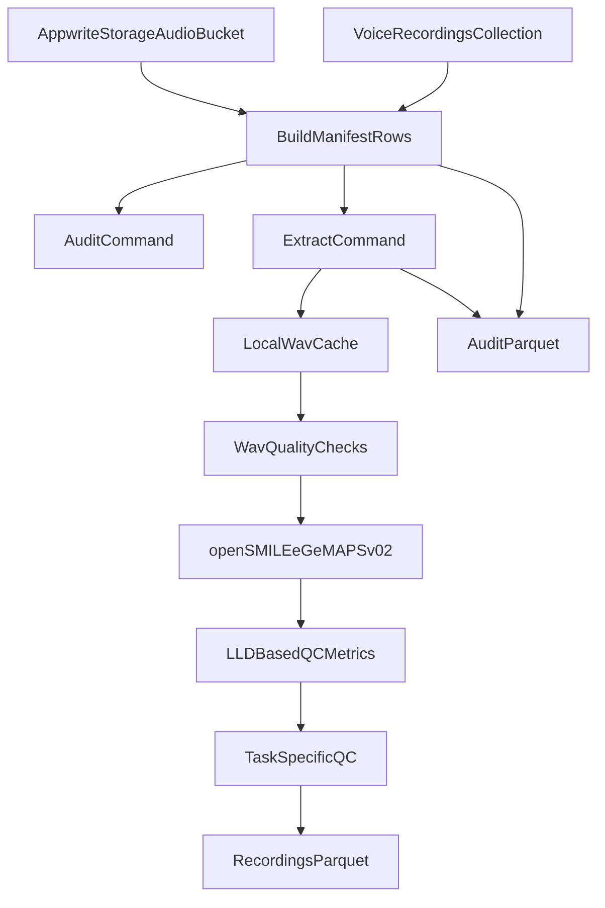
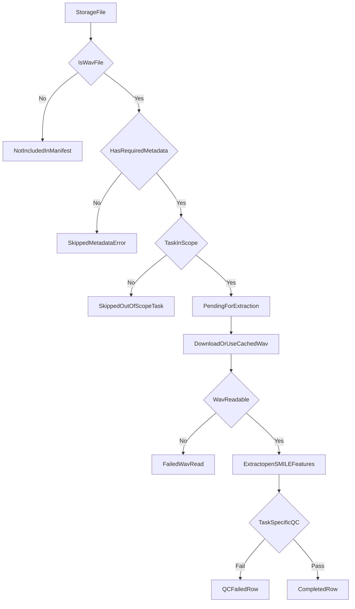
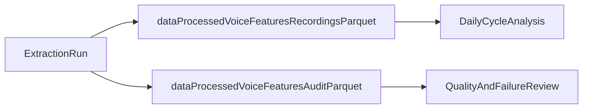

# How This Speech Project Works

This document explains the project in plain language so you can discuss it confidently, even if you are new to coding.

## 1) What problem this project solves

You have voice recordings saved in Appwrite, and you want a **reproducible** way to turn them into analysis-ready data.

The project does that by:
- finding audio files in Appwrite
- matching them with recording metadata
- selecting only in-scope tasks (`vowel` and `prosody`)
- extracting standard openSMILE features (`eGeMAPSv02`, functionals)
- writing clean Parquet outputs for analysis and auditing

The scientific question behind this is:
> Does my voice change along my menstrual cycle?

## 2) High-level system flow



## 3) What each command does

### `extract-speech-features audit`
- Reads Appwrite storage files and metadata
- Builds an audit manifest
- Writes one audit parquet file
- Does **not** run feature extraction

### `extract-speech-features extract`
- Builds the same manifest
- Processes only rows marked as pending
- Downloads WAVs (or uses local cache)
- Runs WAV quality checks
- Runs openSMILE extraction
- Writes:
  - recording-level feature parquet
  - audit parquet with status and warnings

## 4) Decision logic for each recording



## 4.1) Task-specific quality control

Sustained vowels and connected speech (prosody) have fundamentally different acoustic characteristics, so they require different quality criteria. This follows best practices from:
- ASHA Expert Panel 2018 protocols for voice assessment
- eGeMAPS (Eyben et al. 2015) documentation on voiced/unvoiced segmentation
- MDVP clinical thresholds for jitter/shimmer

### Vowel task QC criteria

| Criterion | Threshold | Rationale |
|-----------|-----------|-----------|
| Duration | 2-15 seconds | ASHA recommends 3-5s, analyze middle portion |
| Voiced ratio | > 90% | Sustained vowel should be almost entirely voiced |
| F0 stability (CoV) | < 20% (warning threshold) | Unstable pitch indicates poor task compliance |
| Jitter | < 1.5% (warning threshold) | MDVP reference threshold is 1.04% |
| Shimmer | < 4.5% (warning threshold) | MDVP reference threshold is 3.81% |
| Clipping | < 0.1% | Any clipping invalidates perturbation measures |

### Prosody task QC criteria

| Criterion | Threshold | Rationale |
|-----------|-----------|-----------|
| Duration | 2.5-30 seconds | Longer samples needed for temporal patterns |
| Voiced ratio | 30-95% (high end warns) | Should have both voiced and unvoiced (pauses) |
| Clipping | < 0.1% | Background noise affects pause detection |

Note: Jitter/shimmer thresholds are NOT applied to prosody because these metrics are only reliable for sustained phonation. Perturbation thresholds are used as practical QC screening values, not clinical diagnostic cutoffs.

### How voiced ratio is computed

The pipeline extracts Low-Level Descriptors (LLDs) from openSMILE in addition to Functionals. The LLD feature `F0semitoneFrom27.5Hz_sma3nz` uses the "nz" (non-zero) convention: frames where F0 could not be detected have value 0. The voiced ratio is simply:

```
voiced_ratio = count(frames where F0 > 0) / total_frames
```

## 5) Core files and responsibilities

- `src/speech_feature_extraction/cli.py`
  - command entrypoint (`audit`, `extract`)
- `src/speech_feature_extraction/pipeline.py`
  - orchestration for audit and extraction runs
- `src/speech_feature_extraction/appwrite_gateway.py`
  - reads files/metadata and downloads audio from Appwrite
- `src/speech_feature_extraction/metadata.py`
  - builds normalized manifest rows and skip reasons
- `src/speech_feature_extraction/audio_qc.py`
  - SHA256 hashing, WAV format checks, and clipping detection
- `src/speech_feature_extraction/opensmile_egemaps.py`
  - wraps openSMILE eGeMAPSv02 extraction (both Functionals and LLDs)
- `src/speech_feature_extraction/task_qc.py`
  - task-specific quality control for vowel vs prosody recordings
- `src/speech_feature_extraction/constants.py`
  - shared constants including task-specific QC thresholds
- `src/speech_feature_extraction/parquet.py`
  - writes parquet outputs

## 6) Output files and why they matter



- `data/processed/voice_features_v3_recordings.parquet`
  - one row per successfully completed recording
  - includes metadata, lineage fields, QC, and `egemaps_` features
- `data/processed/voice_features_v3_audit.parquet`
  - includes skipped and failed rows with reasons and warning codes
  - helps prove transparency (what was excluded and why)

## 7) Why this method is scientifically credible

The project follows your user-story methodology:
- standard toolchain (Appwrite + openSMILE + parquet outputs)
- explicit in-scope tasks (`vowel`, `prosody`)
- reproducibility via extractor metadata and file hashing
- transparent auditing instead of silently dropping bad rows
- **task-specific quality gating** based on published clinical protocols (ASHA 2018, MDVP thresholds, eGeMAPS documentation)

The task-specific QC is particularly important because:
1. Sustained vowels and connected speech have different expected characteristics
2. Jitter/shimmer metrics are only valid for sustained phonation
3. Voiced ratio expectations differ (vowels should be >90% voiced, prosody should have natural pauses)

This is designed to support an honest research conversation with your professor.

## 8) Current scope vs future scope

### In scope now
- Appwrite ingestion
- metadata normalization
- eGeMAPSv02 functionals extraction
- LLD-based voiced ratio and F0 stability analysis
- task-specific quality gating (different criteria for vowel vs prosody)
- recording-level and audit parquet outputs with detailed QC metrics

### Planned next (not fully implemented yet)
- daily-level table for cycle-day and Oura analysis
- optional exports (CSV/XLSX) generated from parquet
- Praat/Parselmouth feature pass
- exploratory plots and research summary artifacts

## 9) One sentence summary

This project is a reproducible data pipeline that turns raw Appwrite WAV recordings into trustworthy, audit-ready speech features for exploratory menstrual-cycle voice analysis.
