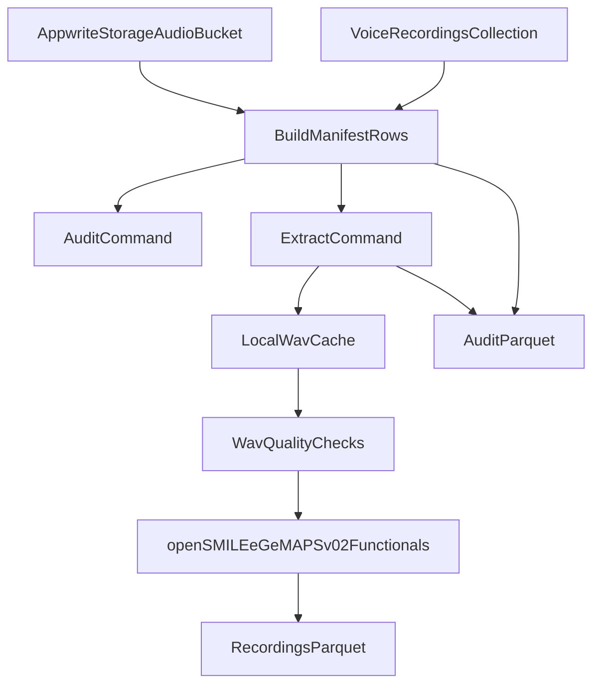
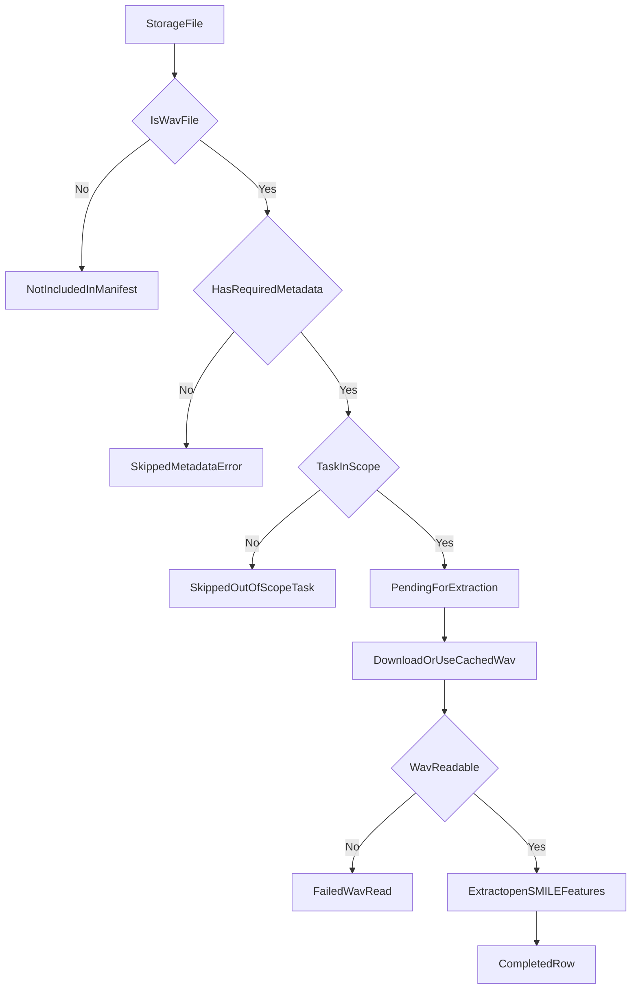
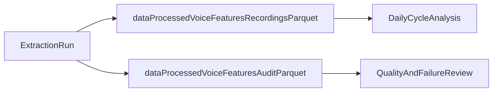

# How This Speech Project Works

This document explains the project in plain language so you can discuss it confidently, even if you are new to coding.

## 1) What problem this project solves

You have voice recordings saved in Appwrite, and you want a **reproducible** way to turn them into analysis-ready data.

The project does that by:
- finding audio files in Appwrite
- matching them with recording metadata
- selecting only in-scope tasks (`vowel` and `prosody`)
- extracting standard openSMILE features (`eGeMAPSv02`, functionals)
- writing clean Parquet outputs for analysis and auditing

The scientific question behind this is:
> Does my voice change along my menstrual cycle?

## 2) High-level system flow

## 3) What each command does

### `extract-speech-features audit`
- Reads Appwrite storage files and metadata
- Builds an audit manifest
- Writes one audit parquet file
- Does **not** run feature extraction

### `extract-speech-features extract`
- Builds the same manifest
- Processes only rows marked as pending
- Downloads WAVs (or uses local cache)
- Runs WAV quality checks
- Runs openSMILE extraction
- Writes:
  - recording-level feature parquet
  - audit parquet with status and warnings

## 4) Decision logic for each recording

## 5) Core files and responsibilities

- `src/speech_feature_extraction/cli.py`
  - command entrypoint (`audit`, `extract`)
- `src/speech_feature_extraction/pipeline.py`
  - orchestration for audit and extraction runs
- `src/speech_feature_extraction/appwrite_gateway.py`
  - reads files/metadata and downloads audio from Appwrite
- `src/speech_feature_extraction/metadata.py`
  - builds normalized manifest rows and skip reasons
- `src/speech_feature_extraction/audio_qc.py`
  - SHA256 hashing and basic WAV checks
- `src/speech_feature_extraction/opensmile_egemaps.py`
  - wraps openSMILE eGeMAPSv02 functionals extraction
- `src/speech_feature_extraction/parquet.py`
  - writes parquet outputs

## 6) Output files and why they matter

- `data/processed/voice_features_v3_recordings.parquet`
  - one row per successfully completed recording
  - includes metadata, lineage fields, QC, and `egemaps_` features
- `data/processed/voice_features_v3_audit.parquet`
  - includes skipped and failed rows with reasons and warning codes
  - helps prove transparency (what was excluded and why)

## 7) Why this method is scientifically credible

The project follows your user-story methodology:
- standard toolchain (Appwrite + openSMILE + parquet outputs)
- explicit in-scope tasks (`vowel`, `prosody`)
- reproducibility via extractor metadata and file hashing
- transparent auditing instead of silently dropping bad rows

This is designed to support an honest research conversation with your professor.

## 8) Current scope vs future scope

### In scope now
- Appwrite ingestion
- metadata normalization
- eGeMAPSv02 functionals extraction
- recording-level and audit parquet outputs

### Planned next (not fully implemented yet)
- daily-level table for cycle-day and Oura analysis
- optional exports (CSV/XLSX) generated from parquet
- Praat/Parselmouth feature pass
- exploratory plots and research summary artifacts

## 9) One sentence summary

This project is a reproducible data pipeline that turns raw Appwrite WAV recordings into trustworthy, audit-ready speech features for exploratory menstrual-cycle voice analysis.
