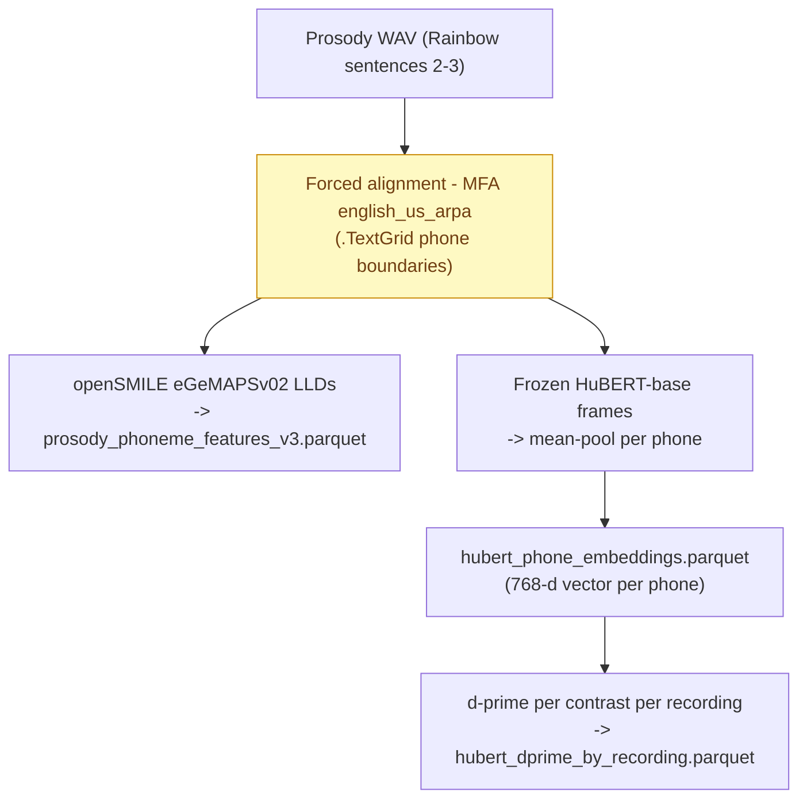
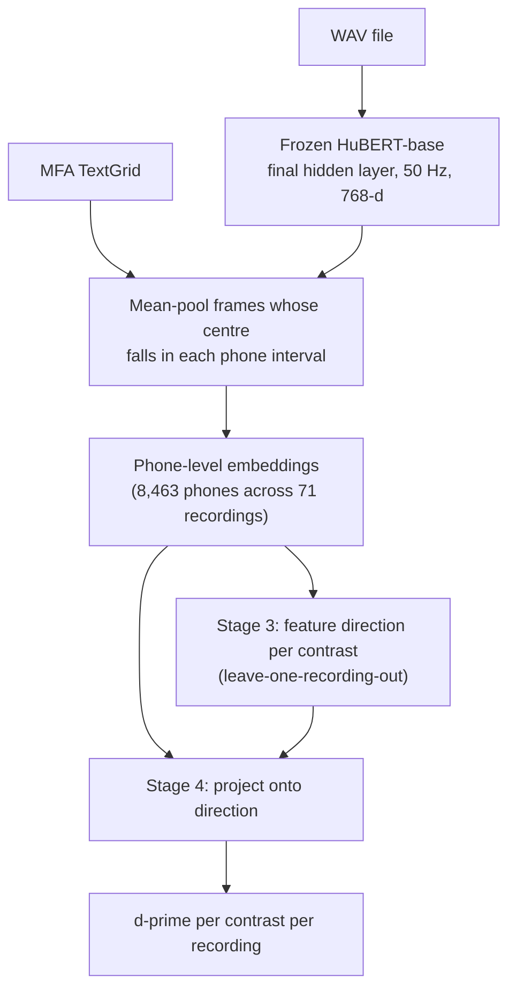

# HuBERT Phonological-Subspace Methodology

## Purpose

This overview explains how we turn the same MFA phone alignments used by the
eGeMAPS phoneme pipeline into a second, complementary feature set: the
**phonological separability** of frozen HuBERT speech representations, measured
as a *d-prime* per phonological contrast per recording.

The method adapts the training-free phonological-subspace analysis of Muller,
Ortiz Barranon and Roberts (2026) [1, 2] from clinical dysarthria severity to a
within-speaker longitudinal design. Where the original work asks "how separable
are phonological categories in a dysarthric speaker versus healthy controls?",
we ask "how separable are they across recordings of the **same** speaker reading
the **same** passage?" — the substrate for a downstream follicular-vs-luteal
comparison that happens in the Analysis project, not here.

The unit hierarchy mirrors the eGeMAPS side:

`WAV recording -> phone embedding -> per-recording d-prime per contrast`

## Where this sits relative to the eGeMAPS phoneme pipeline

The two extractors are **parallel, not nested**. They share the MFA boundaries
and diverge afterwards:



eGeMAPS measures *acoustic* properties (MFCC2, H1-H2, formant bandwidths) in
named, interpretable units. HuBERT d-prime measures *representational*
separability in a learned embedding space. They answer the same scientific
question — does the cycle reorganise phoneme structure? — from two independent
measurement families, which is the point: agreement is corroboration,
disagreement is informative.

## Method (four stages, after Muller et al. 2026)



1. **Frame embeddings.** Frozen `facebook/hubert-base-ls960`, final hidden
   layer, 16 kHz input. The convolutional front end has total stride 320
   samples, so one frame represents ~20 ms (~50 Hz). The model is run once over
   the whole recording (HuBERT needs surrounding context), exactly as openSMILE
   LLDs are extracted whole-file on the eGeMAPS side.
2. **Per-phone pooling.** Each phone claims the frames whose centre falls in its
   MFA interval and averages them into one 768-d vector. Phones shorter than one
   frame fall back to the single nearest frame so every aligned phone yields an
   embedding.
3. **Feature directions.** For each binary contrast (e.g. `[+nasal]` vs
   `[-nasal]`), the direction is the difference between the mean embeddings of
   the two phone categories. The paper estimates this from a disjoint
   healthy-control group; we have no such group, so by default each recording's
   direction is estimated **leave-one-recording-out** (from every *other*
   recording). This keeps the direction independent of the recording it scores.
4. **Projection + d-prime.** Each recording's phones are projected onto the
   direction and category separation is quantified with the signal-detection
   sensitivity index

   \[ d' = \frac{|\mu_{+} - \mu_{-}|}{\sqrt{\tfrac{1}{2}(\sigma^2_{+} + \sigma^2_{-})}} \]

   A contrast needs at least 5 tokens in **each** pole for a valid estimate;
   otherwise it is missing for that recording.

## Two methodological strengths over the source paper

**1. The token-count confound is controlled by design.** The paper's central
caveat is that d-prime correlates with the number of phone tokens a speaker
produces, and they spend considerable effort (fixed-token subsampling,
log-token regression) attenuating it. Here the speaker reads a **fixed passage**
(Rainbow sentences 2-3), so token counts per contrast are near-constant across
recordings (e.g. nasality is 12 vs 23 in essentially every recording). The
confound is removed at the source rather than corrected after the fact.

**2. Leave-one-recording-out direction estimation removes in-sample inflation.**
A single pooled "grand-mean" direction is fit and scored on the same tokens,
which yields a non-zero d-prime even for random embeddings (empirically ~1.0-1.5
in this dataset). Estimating the direction from the held-out recordings collapses
that floor to ~0.2, so reported d-primes reflect genuine, out-of-sample
separability. The difference between the two estimators is itself a useful
diagnostic.

## Phonological contrasts (ARPAbet)

Nine binary segmental contrasts mirror the paper's nine segmental d-prime
features. Phone-set membership reuses the canonical ARPAbet inventory and the
vowel height/backness assignments from `taxonomy.py` (diphthongs by nucleus).

| Contrast | Distinctive feature | [+] phones | [-] phones | Median tokens (+/-) |
|----------|--------------------|-----------|-----------|---------------------|
| nasality | [+nasal] vs oral stop | M N NG | P B T D K G | 12 / 23 |
| voicing | [+voice] obstruents | B D G V DH Z ZH JH | P T K F TH S SH CH | 23 / 21 |
| sonorance | [+sonorant] consonant | M N NG L R W Y | obstruents | 24 / 44 |
| stridency | [+strident] | S Z SH ZH CH JH | F V TH DH | 10 / 11 |
| manner | [+continuant] | fricatives | stops | 22 / 23 |
| vowel_height | [+high] | IY IH UW UH | non-high vowels | 13 / 36 |
| vowel_lowness | [+low] | AE AA AY AW | non-low vowels | 9 / 40 |
| vowel_backness | [+back] | AA AO UH UW OY OW | front vowels | 6 / 23 |
| vowel_rounding | [+round] | UW UH AO OW OY | unrounded vowels | 4 / 45 |

Eight of nine contrasts clear the 5-token minimum in 100% of recordings. Only
**vowel_rounding** is genuinely sparse in this passage (~4 rounded tokens), so it
is missing for nearly all recordings — reported honestly rather than forced.

## Outputs (data-prep only)

| File | Grain | Contents |
|------|-------|----------|
| `hubert_phone_embeddings.parquet` | one row / phone | `recordingId`, `phonemeIndex`, `phonemeLabel`, `startSec`, `endSec`, `hubert_0..hubert_767` (float32), `modelName`, `hubertLayer`, `nFramesPooled`, lineage. Joins to `prosody_phoneme_features_v3.parquet` on `(recordingId, phonemeIndex)`. |
| `hubert_dprime_by_recording.parquet` | one row / recording | `recordingId`, `recordedDate`, `userId`, `n_phones_total`, `dprime_<contrast>` x9, `n_<contrast>_pos` / `n_<contrast>_neg` x9. |

Consistent with `USER_STORIES.md`, this repository stops at the d-prime table:
**no cycle-phase join, statistics, plotting, or conclusions.** `recordedDate` is
carried so the Analysis project can join the shared cycle calendar exactly as it
already does for the eGeMAPS phoneme parquet, then run the follicular-vs-luteal
tests there.

## Validation / sanity (current run: 71 qc-passing recordings)

Median d-prime per contrast (final layer, leave-one-recording-out):

| Contrast | Median d' | Coverage |
|----------|-----------|----------|
| stridency | 7.22 | 100% |
| vowel_backness | 5.47 | 100% |
| nasality | 3.08 | 100% |
| sonorance | 3.01 | 100% |
| vowel_lowness | 2.94 | 100% |
| voicing | 2.96 | 100% |
| vowel_height | 2.90 | 100% |
| manner | 2.66 | 100% |
| vowel_rounding | n/a | 0% |

The ordering is the expected one: the most acoustically distinct categories —
sibilants (stridency) and front-vs-back vowels (backness) — separate most
strongly, and every reported d-prime is an order of magnitude above the ~0.2
leave-one-out noise floor. This confirms HuBERT linearly encodes these contrasts
and that the pipeline recovers them.

## Limitations and open questions

- **Absolute d-prime is not calibrated.** As the source paper stresses, absolute
  magnitudes depend on recording conditions and content; only *within-dataset*
  comparisons (here, across this speaker's recordings) are meaningful.
- **Layer choice.** We use the final hidden layer (paper default); layers 9-12
  are sometimes more phonetic. `--layer` exposes this for a sensitivity check.
- **Direction double-dipping is mitigated, not eliminated.** Leave-one-recording-
  out removes the per-recording circularity; a residual shared-speaker component
  remains but is constant across phases and cancels in a phase contrast.
- **vowel_rounding** is underpowered in this passage and should be excluded from
  the primary analysis.

## How to reproduce

```bash
pip install -e '.[hubert]'   # torch, torchaudio, transformers, soundfile
# Requires prosody_phoneme_features_v3.parquet (MFA boundaries) to exist.
extract-speech-features extract-phoneme-hubert --device cpu
# Recompute only the d-prime table from existing embeddings:
extract-speech-features extract-phoneme-hubert --dprime-only
```

The run is resumable (embeddings are written after each recording) and took ~35 s
on CPU for 71 recordings.

## References

1. Muller B., Ortiz Barranon A. A., Roberts L. *Phonological Subspace Collapse Is
   Aetiology-Specific and Cross-Lingually Stable: Evidence from 3,374 Speakers.*
   arXiv:2604.21706 (2026).
2. Muller B. et al. *Training-Free Cross-Lingual Dysarthria Severity Assessment
   via Phonological Subspace Analysis in Self-Supervised Speech Representations.*
   arXiv:2604.10123 (2026).
3. Hsu W.-N. et al. *HuBERT: Self-Supervised Speech Representation Learning by
   Masked Prediction of Hidden Units.* IEEE/ACM TASLP (2021).
4. Choi K. et al. *Self-supervised speech representations encode phonological
   features in position-dependent orthogonal subspaces.* (referenced in [1]).
