# Phoneme Prosody Experiment: A Complete Guide

This document walks you through the phoneme prosody experiment pipeline - a system designed to extract acoustic features from individual phonemes (speech sounds) in recordings. The goal is to track subtle changes in speech patterns over time.

## Table of Contents

1. [What This System Does](#what-this-system-does)
2. [The Big Picture](#the-big-picture)
3. [Core Concepts](#core-concepts)
4. [File-by-File Breakdown](#file-by-file-breakdown)
5. [The Pipeline Flow](#the-pipeline-flow)
6. [Key Data Structures](#key-data-structures)
7. [Longitudinal Analysis](#longitudinal-analysis)
8. [Putting It All Together](#putting-it-all-together)

---

## What This System Does

Imagine you record someone reading a standardized passage (the "Rainbow Passage"). This system:

1. **Aligns** the audio to text, identifying exactly when each sound (phoneme) occurs
2. **Extracts** acoustic features from each tiny phoneme segment
3. **Assesses** the quality of each measurement
4. **Aggregates** data over time to track longitudinal changes

---

## The Big Picture

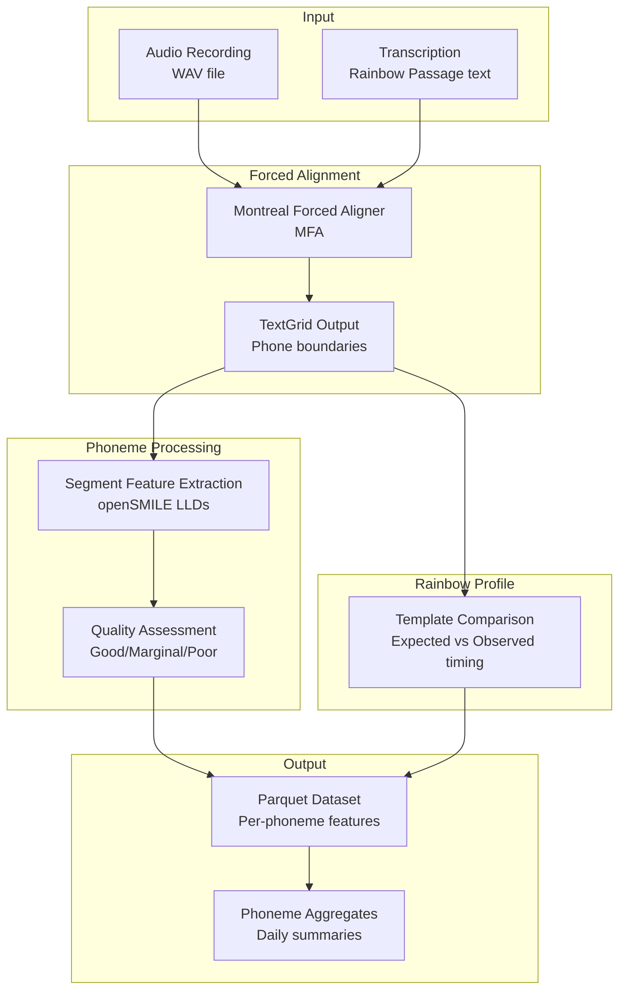

---

## Core Concepts

### What is a Phoneme?

A **phoneme** is the smallest unit of sound in speech. For example:
- The word "cat" has 3 phonemes: /K/ /AE/ /T/
- The word "rainbow" has 6 phonemes: /R/ /EY/ /N/ /B/ /OW/

This system uses **ARPAbet notation**, a standard way to represent American English phonemes:

| ARPAbet | Sound | Example |
|---------|-------|---------|
| AA | "ah" | f**a**ther |
| AE | "a" | c**a**t |
| M | "m" | **m**other |
| N | "n" | **n**ose |
| NG | "ng" | si**ng** |
| EY | "ay" | s**ay** |
| IY | "ee" | s**ee** |

### What is Forced Alignment?

**Forced alignment** takes an audio recording and its transcription, then figures out exactly when each word and phoneme occurs. Think of it like automatic subtitles, but at the phoneme level.

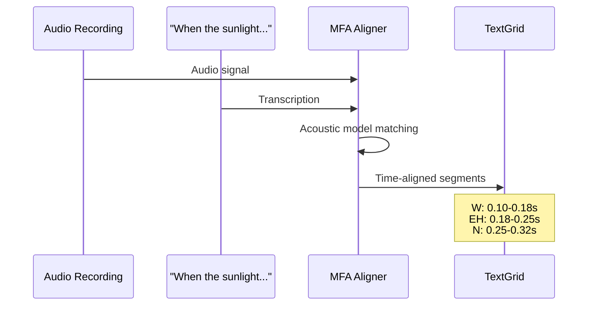

### Why the Rainbow Passage?

The **Rainbow Passage** is a standardized text used in speech research. It contains all the phonemes of American English in natural contexts. Because everyone reads the same text, we can:

1. Compare the same phonemes across different speakers
2. Track the same phonemes for one speaker over time
3. Build "templates" of expected phoneme timing

---

## File-by-File Breakdown

### 1. `schema.py` - The Data Dictionary

This file defines what columns appear in the output dataset. Think of it as the "contract" for what data the pipeline produces.

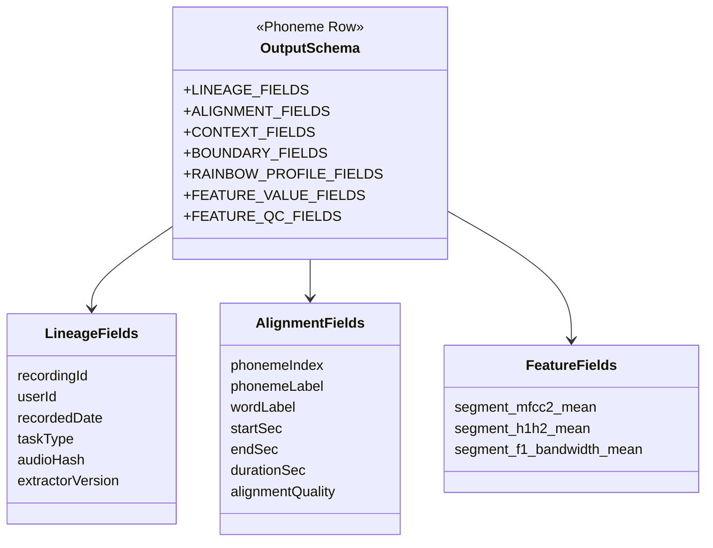

**Key insight**: The schema is organized into logical groups:
- **Lineage**: Where did this data come from?
- **Alignment**: When does this phoneme occur?
- **Context**: What's before/after this phoneme?
- **Features**: What are the acoustic measurements?
- **QC**: Can we trust this measurement?

---

### 2. `taxonomy.py` - Phoneme Normalization and Classification

This file standardizes phone labels and assigns phoneme classes/tags.

Alignment uses the ARPAbet-native `english_us_arpa` models, so MFA emits
ARPAbet phones directly with optional stress markers (e.g., "AH0", "AH1").
`normalize_phoneme_label()`:
- Strips stress suffixes and uppercases (e.g., "AH0" -> "AH")
- Falls back to an IPA-to-ARPAbet map only as a defensive measure if a
  non-ARPAbet symbol ever appears

```python
normalize_phoneme_label("ah1")  # Returns "AH"
normalize_phoneme_label("M")    # Returns "M"
```

Canonical-label guard: `is_canonical_phoneme()` reports whether a normalized
label is in the ARPAbet inventory. The pipeline records this per row as
`qc_label_canonical`, so any unmapped phone is surfaced in QC instead of
silently leaking into `phonemeLabel`.

`classify_phoneme()` also assigns a granular `phonemeClassPrimary`, overlap
`phonemeClassTags` (nasal-coupled, pharyngeal-engaged, oral-anterior,
voiceless-frication), and a nasal `coarticulationContext` from the
neighboring phones.

---

### 3. `alignment.py` - MFA Integration

This file wraps the Montreal Forced Aligner (MFA), an external tool that does the heavy lifting of phoneme alignment. It uses the ARPAbet-native models so phones come out as ARPAbet directly:

```bash
mfa model download acoustic english_us_arpa
mfa model download dictionary english_us_arpa
```

**Recorded transcription scope**: the prosody task records only sentences 2-3 of the Rainbow Passage (`PROSODY_CANONICAL_TRANSCRIPTION`): "The rainbow is a division of white light into many beautiful colors. These take the shape of a long round arch, with its path high above, and its two ends apparently beyond the horizon." Alignment also tries duration-based candidates if the canonical text does not align.

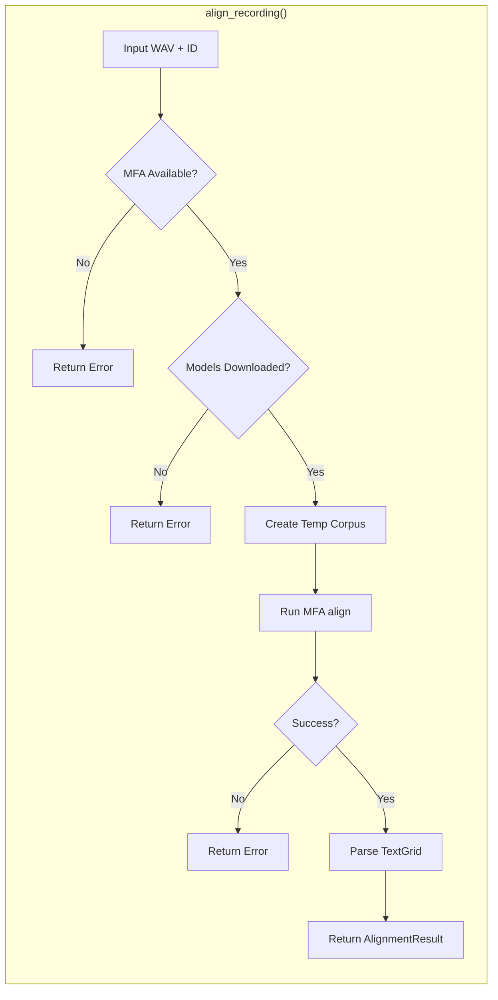

**What happens under the hood**:

1. Checks if MFA is installed and models are available
2. Creates a temporary "corpus" folder with the audio and transcription
3. Runs MFA's alignment command
4. Parses the resulting TextGrid file
5. Returns structured segment data

**The TextGrid format**: MFA outputs a Praat TextGrid file with tiers for words and phones. Each tier contains intervals with start time, end time, and label.

---

### 4. `alignment_quality.py` - Quality Assessment

Not all alignments are created equal. Short segments or unusual timing might indicate alignment errors. This module assesses quality.

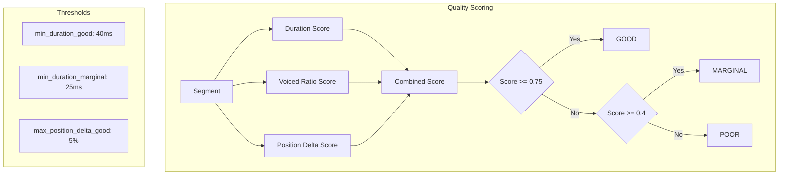

**Quality factors**:

1. **Duration**: Phonemes under 25ms are suspicious - they might be alignment artifacts
2. **Voiced Ratio**: For voiced sounds, we expect some voicing - low ratios suggest problems
3. **Position Delta**: If a phoneme occurs far from where we expect it in the passage, something might be wrong

---

### 5. `segment_features.py` - Acoustic Feature Extraction

This is where the actual acoustic analysis happens. openSMILE LLDs are
extracted **once over the whole recording** (`extract_recording_frames`), and
each phoneme then claims the frames whose center falls inside its trimmed
window (`aggregate_window`). Running openSMILE on per-phoneme audio slices is
avoided on purpose: its analysis windows need surrounding context, so a tiny
clip returns a single all-NaN "Segment too short" placeholder frame instead of
real features.

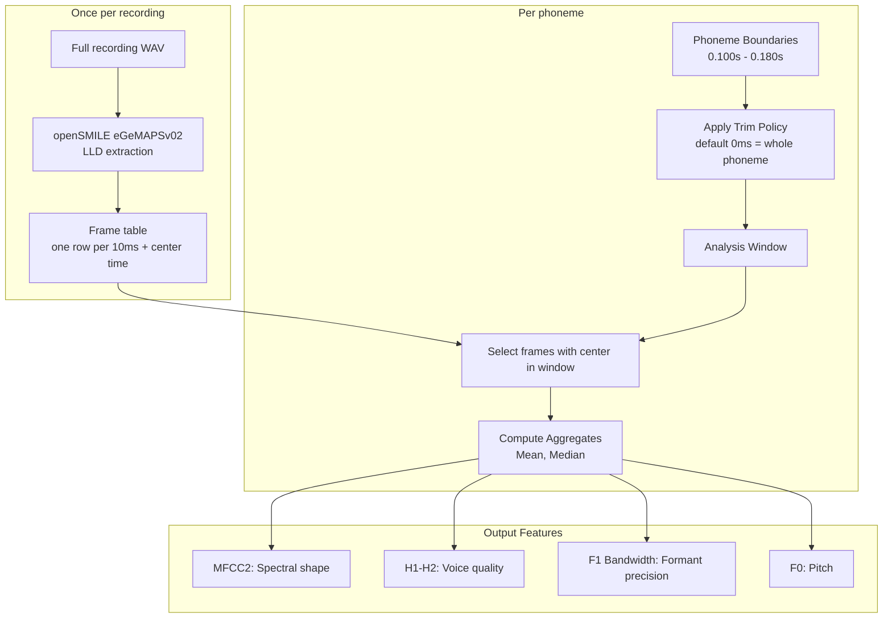

**Why the trim policy defaults to 0 ms?**

At phoneme transitions the acoustic signal is "blended" between sounds, so an optional trim can isolate the steady-state portion. However, the vowel-formant literature finds that averaging across the whole interval (the "Full" method) is the most reliable, and a fixed 20 ms-per-side trim would discard most of a typical 70 ms phoneme. So the default trim is 0 ms (whole-phoneme averaging), which also makes the 4-frame (40 ms) QC threshold act as a clean ">=40 ms" inclusion criterion. Coarticulation is captured separately via `coarticulationContext` rather than by trimming. A positive `trim_policy_ms` re-enables steady-state trimming; because frames come from the full-file extraction, trimming only narrows which frames a phoneme keeps, never the audio handed to openSMILE.

**Why a 4-frame minimum?** At a 10 ms hop, 4 frames = 40 ms, the minimum phoneme duration for reliable formant/spectral measurement in the phonetics literature (30 ms is only the forced-alignment floor). Shorter phones still get features computed but are flagged `qc_segment_ok = False`.

**Key features extracted**:

| Feature | What It Measures | Clinical Relevance |
|---------|------------------|-------------------|
| MFCC2 | Spectral envelope shape | Changes with resonance patterns |
| H1-H2 | Breathiness/pressed voice | Voice quality changes |
| F1 Bandwidth | First formant precision | Articulatory precision |
| F0 | Fundamental frequency | Pitch control |

---

### 6. `rainbow_profile.py` - Template Matching

The Rainbow Passage is standardized, so we know approximately where each phoneme should occur. This module compares observed timing against expected timing.

> Deferred for the MVP: `process_batch` does not build or pass a template, so the `rainbow*` columns are always `None` in the current output. The fields stay in the schema so the parquet shape is stable when template matching is enabled later. Enabling it first requires reconciling the occurrence-key ordering between `_occurrence_key` (raw segment order) and `summarize_alignment_against_template` (normalized, filtered, time-sorted).

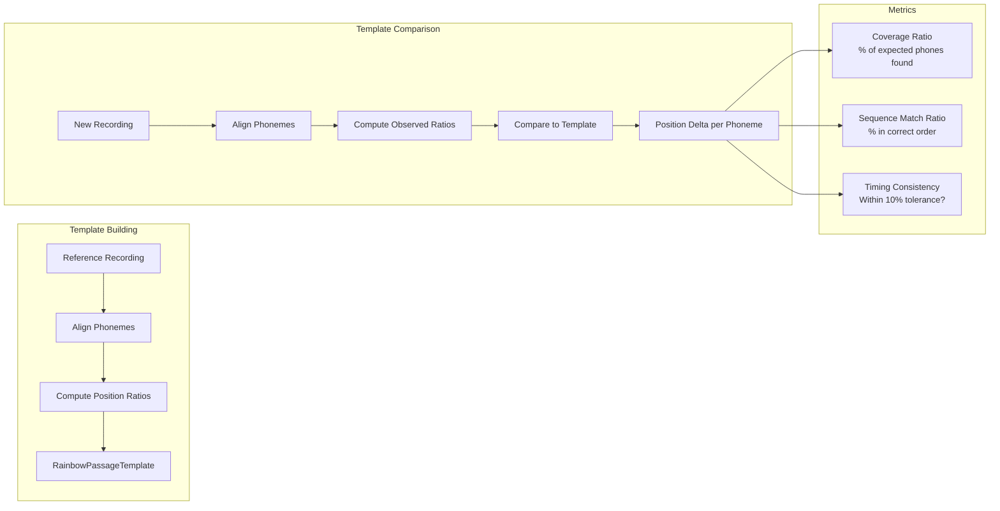

**Position ratio**: Instead of absolute times, we use relative positions. The 50th phoneme at 10s in a 100s recording has position ratio 0.10. This accounts for different speaking rates.

---

### 7. `rainbow_inventory.py` - Expected Phoneme Sequence

This file contains the "ground truth" ARPAbet phoneme sequences. Because the prosody task records only sentences 2-3, coverage validation uses the canonical subset, while the full passage is kept for reference only.

```python
# Recorded subset (sentences 2-3) -> used by validate_phone_coverage().
PROSODY_CANONICAL_ARPABET_SEQUENCE = (
    # "The rainbow is a division of white light..."
    "DH", "AH", "R", "EY", "N", "B", "OW",
    # ... continues through "...beyond the horizon."
)

# Full passage -> reference only.
RAINBOW_PASSAGE_ARPABET_SEQUENCE = (...)
```

**Why this matters**:
- We can detect missing phonemes (maybe the speaker skipped a word)
- We can detect extra phonemes (maybe alignment hallucinated sounds)
- We can count expected occurrences for statistical power calculations

`validate_phone_coverage()` and `get_expected_phone_count()` operate on the recorded sentences-2-3 subset so coverage checks match what was actually spoken.

---

### 8. `biomarkers.py` - Longitudinal Analysis

Once we have per-phoneme features, we aggregate them to track changes over time.

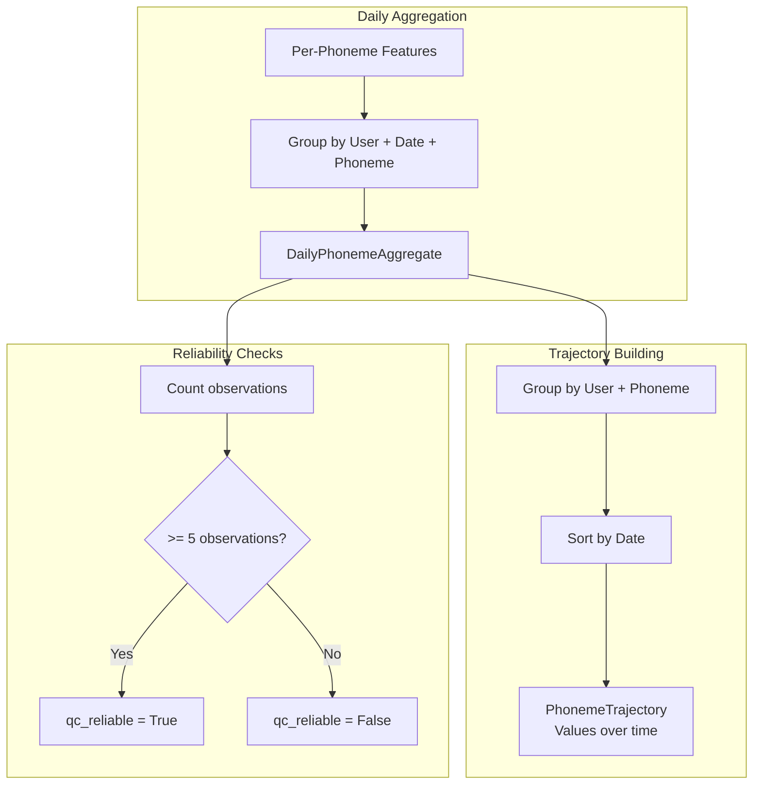

---

### 9. `pipeline.py` - The Orchestrator

This ties everything together into a single processing flow.

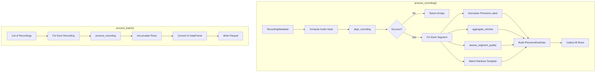

---

## The Pipeline Flow

Here's the complete data flow from audio to aggregates:

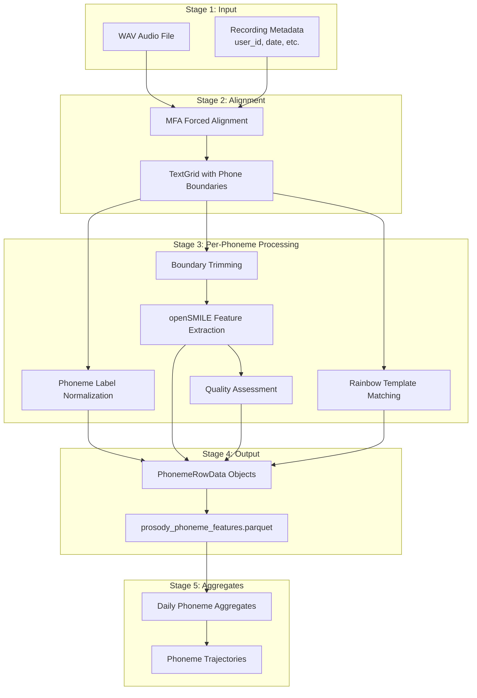

---

## Key Data Structures

### PhonemeRowData

One row per aligned phoneme in the output dataset:

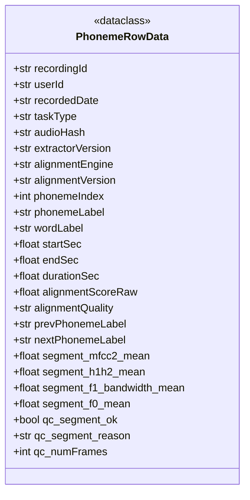

### AlignmentResult

Returned from the MFA alignment step:

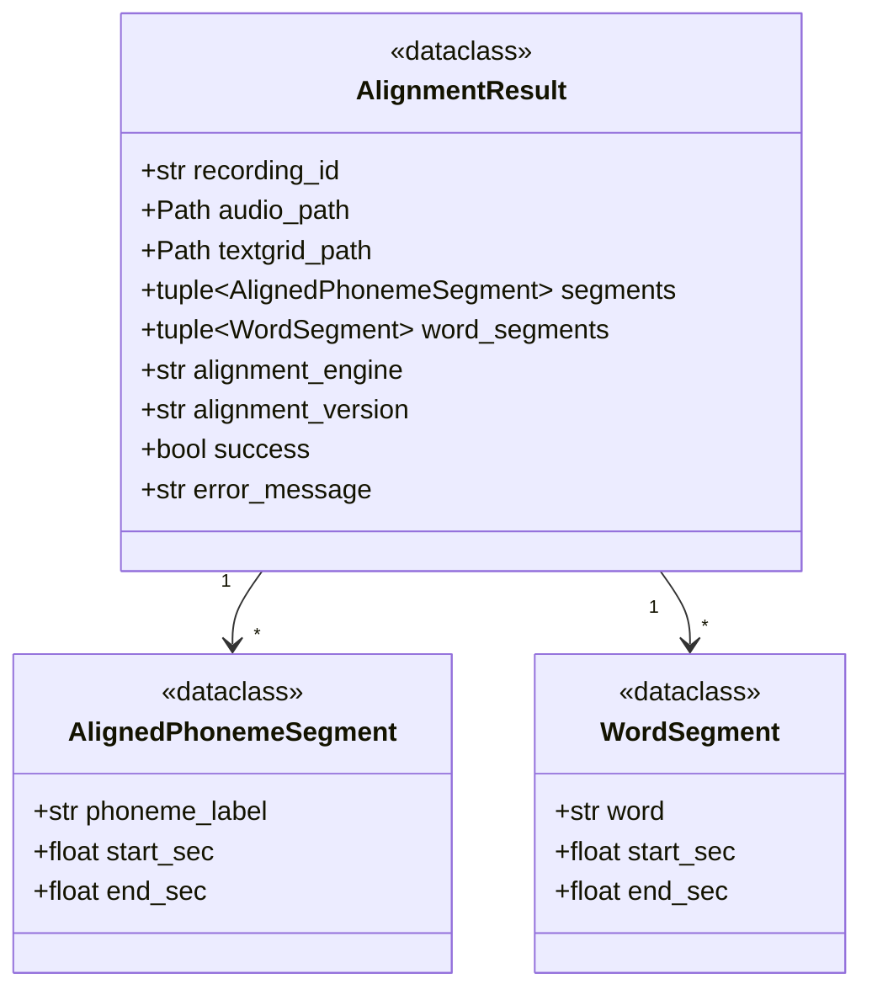

---

## Longitudinal Analysis

### Per-Phoneme Tracking

By collecting data over days/weeks/months, we can detect trends for individual phonemes:

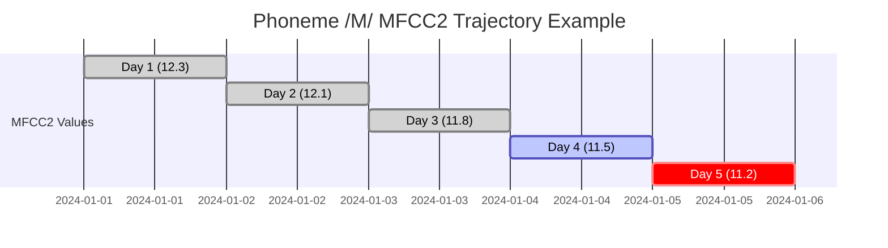

### Reliability Flags

Not all aggregates are equally reliable:

| Observations | Reliability | Reason |
|--------------|-------------|--------|
| >= 5 | Reliable | Sufficient data for stable mean |
| < 5 | Unreliable | High variance, interpret with caution |

---

## Putting It All Together

### Example: Processing One Recording

```python
from speech_feature_extraction.phoneme_prosody_experiment import (
    RecordingMetadata,
    process_recording,
    SegmentFeatureExtractor,
)
from pathlib import Path

# 1. Define the recording
metadata = RecordingMetadata(
    recording_id="rec_001",
    user_id="user_123",
    recorded_date="2024-01-15",
    task_type="rainbow_passage",
    audio_path=Path("/path/to/recording.wav"),
)

# 2. Process it
rows = process_recording(
    metadata=metadata,
    alignments_dir=Path("/output/alignments"),
)

# 3. Each row is one phoneme with full features
for row in rows[:5]:
    print(f"{row.phonemeLabel}: {row.startSec:.3f}s - {row.endSec:.3f}s")
    print(f"  MFCC2: {row.segment_mfcc2_mean}")
    print(f"  Quality: {row.alignmentQuality}")
```

### Example: Computing Trajectories

```python
import pandas as pd
from speech_feature_extraction.phoneme_prosody_experiment import (
    compute_daily_phoneme_aggregates,
    compute_phoneme_trajectories,
)

# Load the extracted features
df = pd.read_parquet("prosody_phoneme_features.parquet")

# Daily aggregates per phoneme
daily_phonemes = compute_daily_phoneme_aggregates(df)

# Longitudinal trajectories
trajectories = compute_phoneme_trajectories(daily_phonemes)

for traj in trajectories:
    if traj.phoneme_label == "M":
        print(f"User {traj.user_id} - /M/ over {traj.total_days} days")
        print(f"  MFCC2 trend: {traj.mfcc2_values}")
        print(f"  Reliable days: {traj.reliable_days}/{traj.total_days}")
```

---

## Summary

The phoneme prosody experiment pipeline extracts acoustic features from speech at the phoneme level. It combines:

1. **Forced alignment** (MFA) to locate phoneme boundaries
2. **Phoneme normalization** for consistent ARPAbet labels
3. **Acoustic feature extraction** (openSMILE) for measurements
4. **Quality assessment** to flag unreliable data
5. **Template matching** for standardized passage comparison
6. **Phoneme aggregation** for longitudinal tracking

The modular design allows each component to be tested and improved independently while maintaining a clean data contract through the schema definitions.

### Future Extensions

The current implementation already includes per-phoneme features, phoneme
groupings (`phonemeClassPrimary`/`phonemeClassTags`), and nasal
`coarticulationContext`. Future versions could add:

- **Rainbow template matching** wired into `process_batch` (currently deferred; `rainbow*` fields are `None`)
- **Clinical biomarkers** derived from phoneme class contrasts
- **ComParE_2016** or Praat/Parselmouth as additional feature extractors
