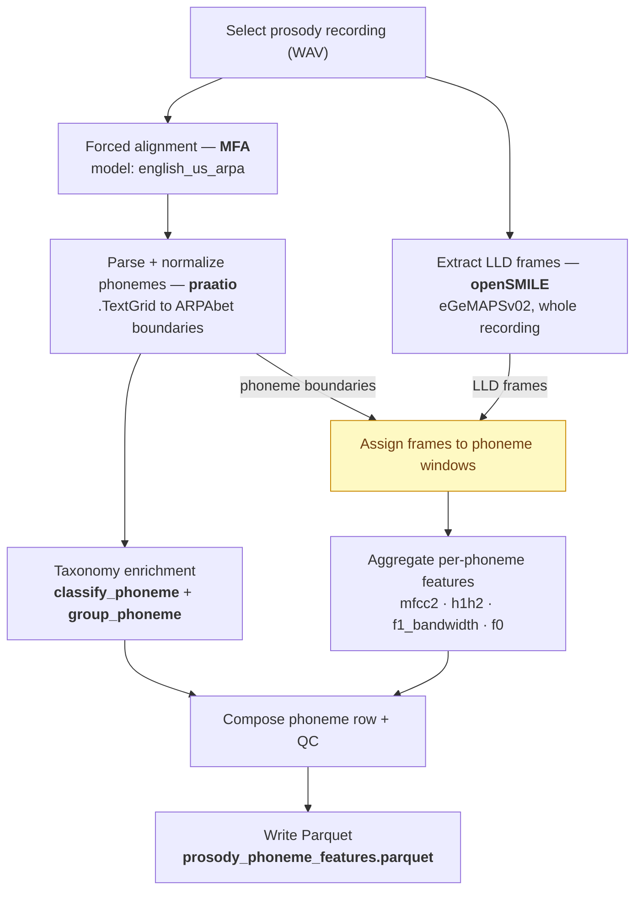
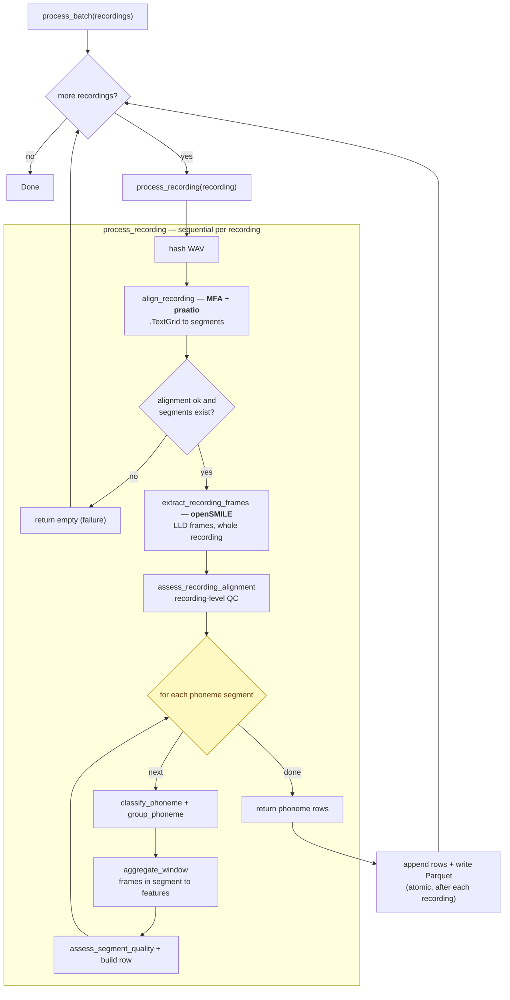

# Phoneme Prosody Methodology Overview

## Purpose

This overview explains how we transform raw prosody recordings into phoneme-level acoustic features with reproducible alignment, quality controls, and taxonomy-based grouping for downstream biomarker analysis.

The unit hierarchy used in analysis is:

`WAV recording -> phoneme grouping -> phoneme unit`

## End-to-End Pipeline

### Logical view (data dependencies)

Two steps are independent and start from the same WAV: forced alignment
(<b>MFA</b>) and full-recording feature extraction (<b>openSMILE</b>). They join
at frame assignment, where openSMILE frames are sliced into phoneme windows
using the alignment boundaries.

### As-coded view (actual execution)

The code runs strictly sequentially. `process_batch` loops over recordings one
at a time; for each one `process_recording` aligns, extracts frames, then loops
over phonemes. Results are written to Parquet after every recording so an
interruption only costs the in-flight recording.

> Both diagrams describe the same work; the first emphasizes *what depends on
> what*, the second emphasizes *the order the code actually executes*.

## What Each Tool Does

- `Montreal Forced Aligner (MFA)` aligns transcript text to audio and produces phoneme/word timing boundaries in `.TextGrid`.
- `praatio` parses `.TextGrid` into structured phone and word segments.
- `openSMILE (eGeMAPSv02 LLD)` extracts frame-level acoustic descriptors over the full WAV.
- `Pandas + Parquet` materialize the final phoneme-level dataset for analysis.
- Internal taxonomy layer (`taxonomy.py`) maps each normalized ARPAbet phoneme to:
  - `phonemeClassPrimary` and `phonemeClassTags` (existing classification tags)
  - `phonemeManner`, `phonemePlace`, `phonemeVoicing`, `phonemeHeight`, `phonemeBroadClass` (new middle grouping)

## Where Taxonomy Fits While TextGrid Processing Is Ongoing

Because `.TextGrid` parsing is the source of phoneme timestamps and labels, taxonomy is attached immediately after parsing/normalization and before final row assembly.

Current flow inside `process_recording` is:

1. Align WAV -> save/read `.TextGrid`
2. Parse phone intervals
3. Normalize phoneme labels
4. Apply taxonomy (`classify_phoneme`, `group_phoneme`)
5. Aggregate acoustic features over the same phoneme intervals
6. Merge taxonomy + features + QC into one phoneme row
7. Append to parquet

This keeps taxonomy and acoustic features synchronized at the same phoneme index and time boundaries.

## Taxonomy Design Rationale

We keep multiple grouping dimensions in separate columns because we do not yet know which grouping is most predictive for biomarker signal:

- Articulatory dimensions: `manner`, `place`, `voicing`, `height`
- Broad class: `obstruent` vs `sonorant`

This avoids prematurely locking into one grouping scheme and supports flexible downstream aggregation (for example: by place, by manner, or by broad class).

## Quality Controls Included in the Flow

- **Alignment-level QC**: recording coverage vs expected prosody phone inventory and unexpected phone count.
- **Segment-level QC**: minimum frame count and segment validity checks.
- **Canonical phone QC**: `qc_label_canonical` indicates whether a label is in the canonical ARPAbet inventory.

## Presentation Talking Points

- We do not extract features from isolated audio snippets first; we extract full-recording LLD frames and then assign frames to phoneme windows from `.TextGrid`.
- Taxonomy enrichment is not a separate disconnected step; it is attached to the same phoneme intervals used for acoustic aggregation.
- The final table is phoneme-granular and analysis-ready, with lineage, timing, taxonomy, acoustic features, and QC on each row.
