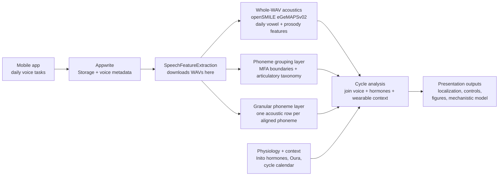
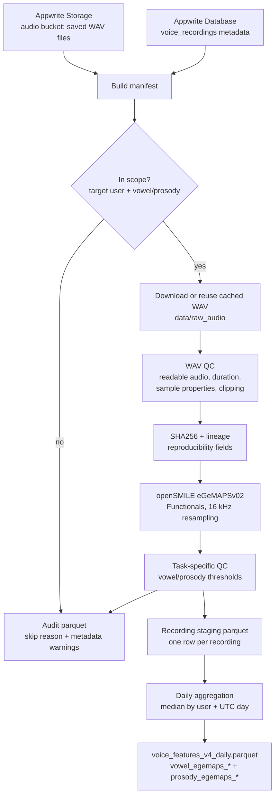
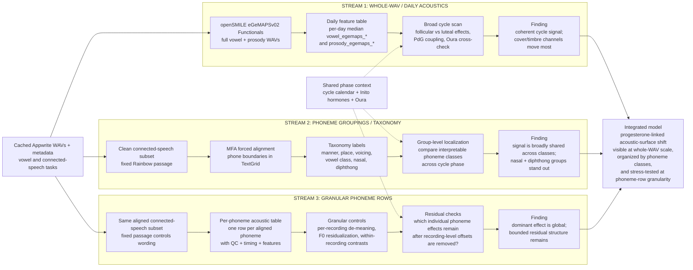

# Data Flow Diagrams

Use the first diagram for the main presentation. The appendix diagrams expose
more implementation detail without making the main slide carry the full method.

## Main Slide: End-to-End Data Flow

**Talk track:** the app captures repeated voice samples; Appwrite is the cloud
source of truth; this repository pulls the WAVs into a reproducible local
pipeline; three analysis streams ask increasingly specific questions about where
cycle-linked voice variation lives.

## Appendix A: Appwrite to Canonical Daily Features

**What this diagram answers:** how a saved mobile recording becomes the
recording-level audit and the daily eGeMAPS feature table used for the broad
cycle scan.

## Appendix B: Mechanistic Analysis Streams

**What this diagram answers:** how the project triangulates the same longitudinal
voice source from three interpretable angles: whole-WAV acoustics, phoneme
grouping/taxonomy, and granular phoneme-row controls.
