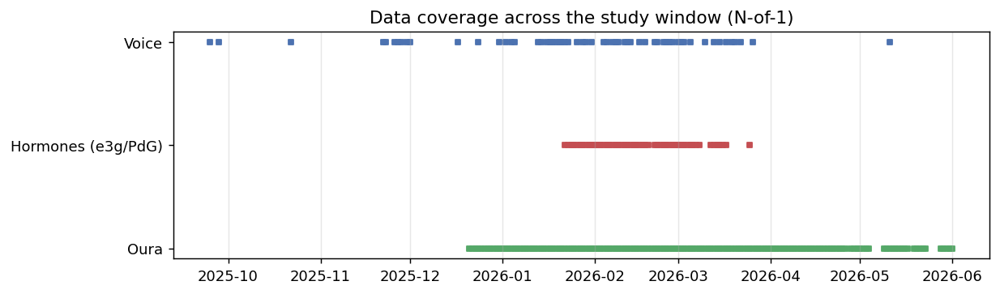
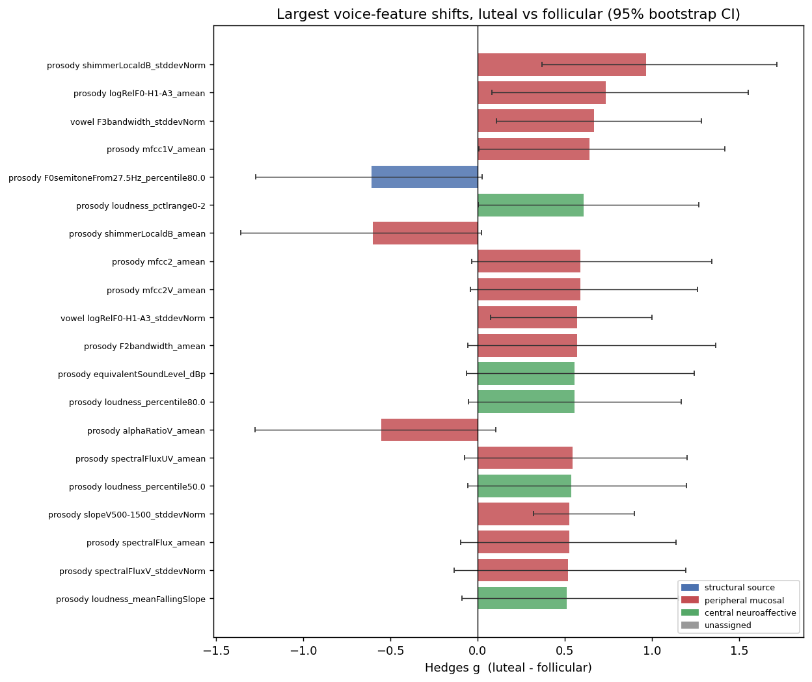
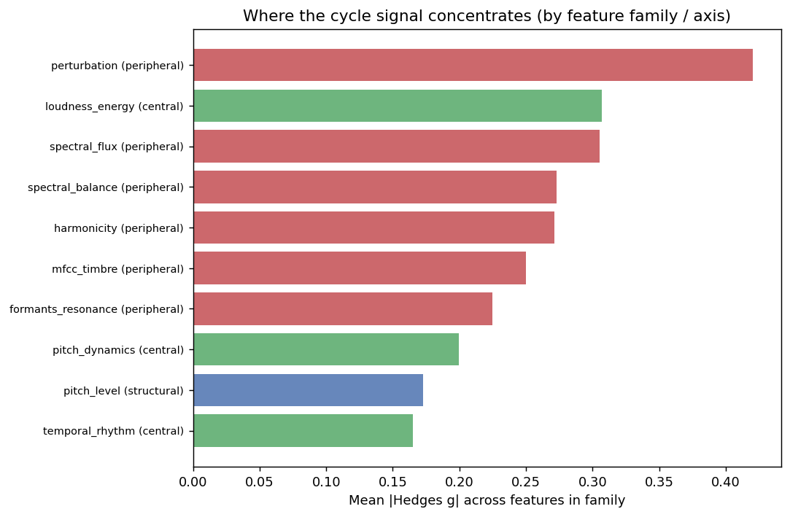
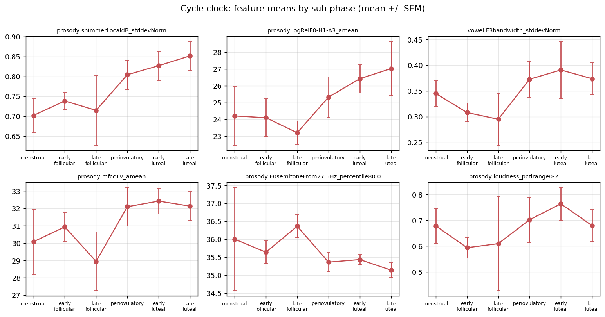
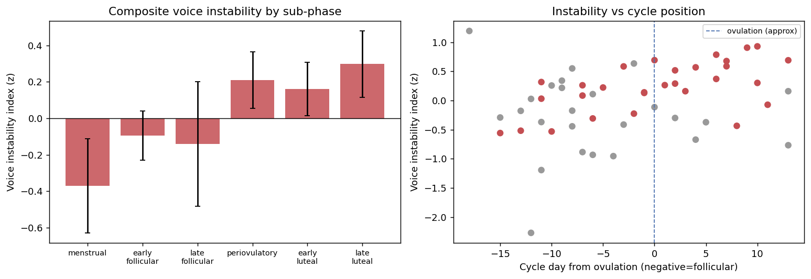
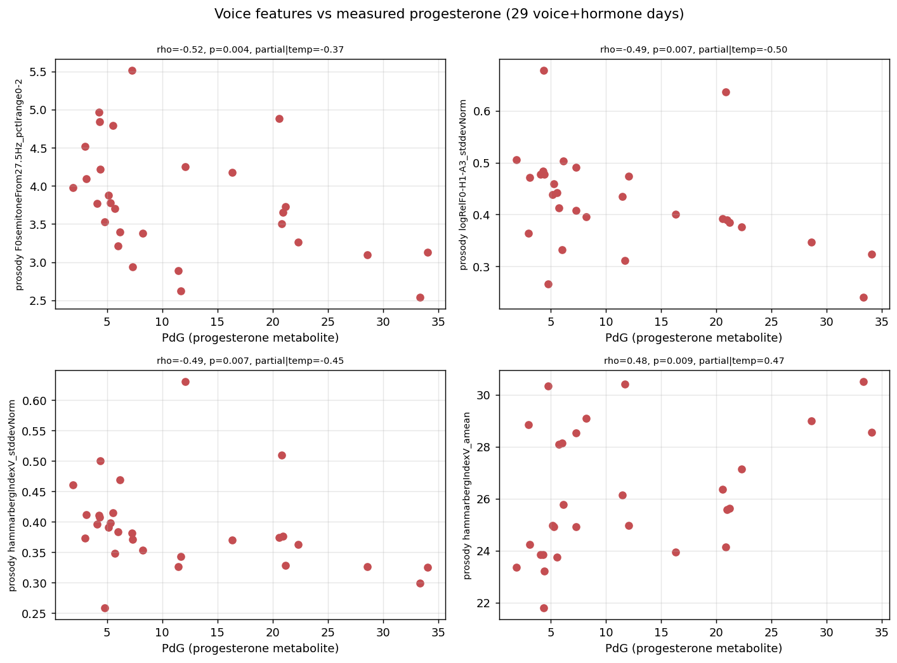
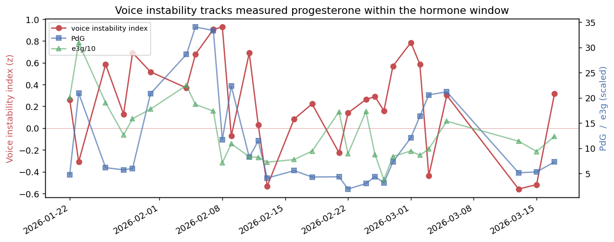
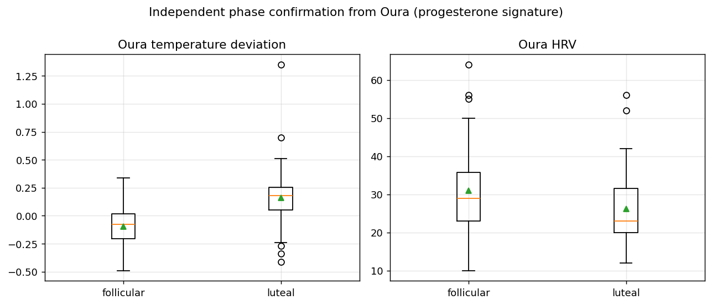
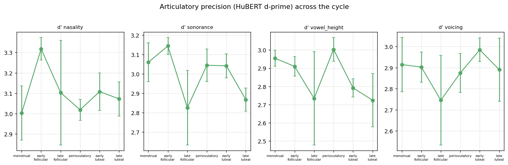

# Voice Across the Menstrual Cycle: An Independent N-of-1 Study

*Exploratory, hypothesis-generating analysis. Single subject with PMDD, naturally
cycling, no medication. 59 voice days across
9 cycles; 29 days with
measured Inito hormones; 48 with Oura.*

## TL;DR

- The cycle signal in this voice is real and coherent, and it is concentrated where
  hormone physiology predicts: the **peripheral / vocal-fold-mucosa** features
  (amplitude perturbation, spectral balance / breathiness, formant-bandwidth
  stability) carry the largest and most cross-cycle-consistent shifts, while the
  **structural pitch level** (mean F0) is among the most stable features, exactly
  the dissociation the gender-affirming-therapy literature implies (androgens set
  pitch architecture; estrogen/progesterone act on the mucosa).
- A composite **voice-instability index rises from a follicular/menstrual low to a
  premenstrual (late-luteal) peak** (means by sub-phase: menstrual
  -0.37, early-follicular -0.09,
  peri-ovulatory 0.21, early-luteal
  0.16, late-luteal 0.30 z).
- **Measured progesterone (PdG) tracks voice**: higher PdG goes with a narrower
  pitch range (rho=-0.52),
  more breathiness-related spectral change, and longer unvoiced/pause segments,
  associations that largely survive partialling out Oura temperature.
- **Independent corroboration from Oura**: temperature is higher in the luteal phase
  (Hedges g=1.14)
  and HRV lower (g=-0.46),
  the progesterone thermogenic + autonomic signature, derived without touching the voice data.
- **Novel angle**: self-supervised (HuBERT) articulatory-contrast separability tends
  to fall in the luteal phase, an under-explored "articulatory precision" readout.

## 1. Background and interpretive framework

Sex-steroid receptors sit on the vocal-fold mucosa, and laryngeal cytology mirrors
cervical cytology across the cycle, so the larynx behaves as a hormonal target organ.
Reading across the siloed literatures (menstrual cycle, menopause, PCOS, gender-affirming
therapy, PMDD) suggests three semi-independent pathways from hormones to voice, which we
use only as an interpretive lens, not as a hypothesis filter:

1. **Structural / source** (vocal-fold mass and tension, sets mean F0): dominated by
   androgens, which barely move across a normal cycle, so mean F0 should be the most
   stable feature. Testosterone therapy lowers F0 by ~6 semitones; adult estrogen does
   not raise F0, dissociating "pitch architecture" from "voice quality."
2. **Peripheral / mucosal** (vocal-fold cover hydration, viscosity, edema, sets voice
   quality and resonance): governed by the estrogen:progesterone balance and net fluid.
   Estrogen (late follicular) hydrates the mucosa; progesterone (luteal) drives edema and
   drying. Predicts cyclic movement in HNR, jitter, shimmer, breathiness (H1-A3, alpha
   ratio, Hammarberg) and formant frequencies/bandwidths.
3. **Central / neuro-affective** (arousal, mood, psychomotor, sets prosody and dynamics):
   governed by progesterone to allopregnanolone (GABAergic) and its premenstrual
   withdrawal. Predicts movement in pitch variability/range, loudness/intensity, speech
   rate/pausing, and articulatory precision.

**PMDD as a lens (not a driver).** The subject has PMDD, an abnormal CNS sensitivity to
normal luteal progesterone/allopregnanolone, with symptoms in the late-luteal window that
remit at menses. Voice-in-PMDD is essentially unstudied, so we did not anchor the analysis
to it; instead we explore the data first and then read the results through this lens, which
predicts that the central pathway (and the late-luteal window) should be where this person
most diverges from the limited "normal-cycling" literature.

## 2. Data and independent methods

This analysis is deliberately independent: it rebuilds the join from components and
re-derives cycle phases rather than inheriting the other project's labels.

- **Voice**: this project's eGeMAPSv02 daily functionals (vowel + connected-speech/prosody),
  176 features, plus per-recording HuBERT phonological d-primes.
- **Hormones**: Inito urinary estrogen (e3g) and progesterone (PdG) metabolites; FSH/LH.
- **Wearable**: raw Oura daily biometrics (temperature deviation, HRV, resting HR, etc.).
- **Phase derivation**: device menses anchor + backward counting from the next menses
  (luteal length is stable), refined by hormones/temperature, giving menses / follicular /
  ovulatory / luteal and finer sub-phases plus a premenstrual (late-luteal) flag. The other
  project's follicular/luteal label is retained only as a cross-check (it agrees with ours).
- **Statistics**: N-of-1 exploratory framing. We lead with effect sizes (Hedges g, Cliff's
  delta), 95% bootstrap CIs, and **cross-cycle consistency** (does the effect repeat across
  the 9 cycles), with Mann-Whitney p / BH-FDR q as context, not gates.

*Daily availability of voice, measured hormone, and Oura data. The hormone-quantified window (29 voice+hormone days) is the densest overlap.*

## 3. Discovery: where the cycle signal lives

A data-first sweep of all 176 features for the follicular-to-luteal contrast shows the
largest, most reliable shifts in peripheral/mucosal families, with structural pitch level
among the most stable, the framework's predicted dissociation, emerging from the data.

| feature | family | axis | g (lut-foll) | CI low | CI high | cross-cycle | n cyc | MW p |
| --- | --- | --- | --- | --- | --- | --- | --- | --- |
| prosody_egemaps_shimmerLocaldB_sma3nz_stddevNorm | perturbation | peripheral_mucosal | 0.97 | 0.37 | 1.71 | 1.00 | 3 | 0.01 |
| prosody_egemaps_logRelF0-H1-A3_sma3nz_amean | spectral_balance | peripheral_mucosal | 0.73 | 0.08 | 1.55 | 1.00 | 3 | 0.03 |
| vowel_egemaps_F3bandwidth_sma3nz_stddevNorm | formants_resonance | peripheral_mucosal | 0.67 | 0.11 | 1.28 | 0.75 | 4 | 0.08 |
| prosody_egemaps_mfcc1V_sma3nz_amean | mfcc_timbre | peripheral_mucosal | 0.64 | 0.01 | 1.42 | 1.00 | 3 | 0.12 |
| prosody_egemaps_F0semitoneFrom27.5Hz_sma3nz_percentile80.0 | pitch_level | structural_source | -0.61 | -1.27 | 0.02 | 1.00 | 3 | 0.15 |
| prosody_egemaps_loudness_sma3_pctlrange0-2 | loudness_energy | central_neuroaffective | 0.61 | 0.00 | 1.27 | 0.33 | 3 | 0.06 |
| prosody_egemaps_shimmerLocaldB_sma3nz_amean | perturbation | peripheral_mucosal | -0.60 | -1.36 | 0.02 | 1.00 | 3 | 0.09 |
| prosody_egemaps_mfcc2_sma3_amean | mfcc_timbre | peripheral_mucosal | 0.59 | -0.03 | 1.34 | 1.00 | 3 | 0.07 |
| prosody_egemaps_mfcc2V_sma3nz_amean | mfcc_timbre | peripheral_mucosal | 0.59 | -0.04 | 1.26 | 1.00 | 3 | 0.18 |
| vowel_egemaps_logRelF0-H1-A3_sma3nz_stddevNorm | spectral_balance | peripheral_mucosal | 0.57 | 0.07 | 1.00 | 0.50 | 4 | 0.21 |
| prosody_egemaps_F2bandwidth_sma3nz_amean | formants_resonance | peripheral_mucosal | 0.57 | -0.06 | 1.36 | 1.00 | 3 | 0.06 |
| prosody_egemaps_equivalentSoundLevel_dBp | loudness_energy | central_neuroaffective | 0.56 | -0.06 | 1.24 | 0.33 | 3 | 0.09 |

*Top features by absolute effect size for the follicular-to-luteal contrast, colored by interpretive axis. Peripheral/mucosal features dominate the largest, most reliable shifts.*

*Average absolute luteal-vs-follicular effect per feature family. Perturbation and spectral-balance (peripheral/mucosal) families carry the strongest mean signal; structural pitch level is among the most stable.*

Mean absolute effect by family confirms the concentration of signal:

| axis | family | n | mean|g| | max|g| | mean consistency |
| --- | --- | --- | --- | --- | --- |
| peripheral_mucosal | perturbation | 8 | 0.42 | 0.97 | 0.77 |
| central_neuroaffective | loudness_energy | 24 | 0.31 | 0.61 | 0.49 |
| peripheral_mucosal | spectral_flux | 10 | 0.31 | 0.55 | 0.56 |
| peripheral_mucosal | spectral_balance | 32 | 0.27 | 0.73 | 0.69 |
| peripheral_mucosal | harmonicity | 4 | 0.27 | 0.44 | 0.38 |
| peripheral_mucosal | mfcc_timbre | 32 | 0.25 | 0.64 | 0.56 |
| peripheral_mucosal | formants_resonance | 36 | 0.22 | 0.67 | 0.62 |
| central_neuroaffective | pitch_dynamics | 12 | 0.20 | 0.44 | 0.64 |
| structural_source | pitch_level | 8 | 0.17 | 0.61 | 0.68 |
| central_neuroaffective | temporal_rhythm | 10 | 0.17 | 0.39 | 0.80 |

*Top features traced across the cycle sub-phases (menstrual through late-luteal). The follicular-to-luteal drift and premenstrual extremes are visible feature by feature.*

## 4. The premenstrual rise: a composite instability index

Collapsing the peripheral-instability panel into one daily index shows a clear progression
from a follicular/menstrual low to a premenstrual (late-luteal) peak.

*A composite of peripheral-instability features rises from a follicular/menstrual low to a premenstrual (late-luteal) peak. Red points are days with measured hormones.*

## 5. Voice vs measured hormones (dose-response, 29 days)

On the days with measured hormones, several features scale with progesterone (PdG), and the
associations largely persist after partialling out Oura temperature, i.e., they are not just
a thermal/autonomic artifact.

| feature | family | axis | rho PdG | p | rho E:P | partial (|temp) |
| --- | --- | --- | --- | --- | --- | --- |
| prosody_egemaps_F0semitoneFrom27.5Hz_sma3nz_pctlrange0-2 | pitch_dynamics | central_neuroaffective | -0.52 | 0.00 | 0.34 | -0.37 |
| prosody_egemaps_logRelF0-H1-A3_sma3nz_stddevNorm | spectral_balance | peripheral_mucosal | -0.49 | 0.01 | 0.36 | -0.50 |
| prosody_egemaps_hammarbergIndexV_sma3nz_stddevNorm | spectral_balance | peripheral_mucosal | -0.49 | 0.01 | 0.39 | -0.45 |
| prosody_egemaps_hammarbergIndexV_sma3nz_amean | spectral_balance | peripheral_mucosal | 0.48 | 0.01 | -0.29 | 0.47 |
| prosody_egemaps_mfcc2V_sma3nz_amean | mfcc_timbre | peripheral_mucosal | 0.45 | 0.02 | -0.31 | 0.43 |
| vowel_egemaps_F2amplitudeLogRelF0_sma3nz_amean | formants_resonance | peripheral_mucosal | -0.44 | 0.02 | 0.17 | -0.40 |
| vowel_egemaps_HNRdBACF_sma3nz_amean | harmonicity | peripheral_mucosal | 0.44 | 0.02 | -0.10 | 0.33 |
| prosody_egemaps_F3frequency_sma3nz_stddevNorm | formants_resonance | peripheral_mucosal | -0.43 | 0.02 | 0.39 | -0.51 |
| vowel_egemaps_MeanUnvoicedSegmentLength | temporal_rhythm | central_neuroaffective | 0.42 | 0.02 | -0.21 | 0.33 |
| prosody_egemaps_F3frequency_sma3nz_amean | formants_resonance | peripheral_mucosal | 0.42 | 0.02 | -0.10 | 0.45 |

*The voice features most strongly associated with measured progesterone (PdG). Associations largely persist after partialling out Oura temperature.*

*Within the measured-hormone window, the daily voice-instability index rises and falls with progesterone (PdG), the integrative N-of-1 view.*

## 6. Independent confirmation from the wearable

Using only Oura (no voice), the luteal phase shows the expected progesterone signature,
validating the phase labels and providing a hormone proxy beyond the hormone window.

| metric | luteal mean | foll mean | g (lut-foll) | MW p | n lut | n foll |
| --- | --- | --- | --- | --- | --- | --- |
| temp_deviation | 0.16 | -0.10 | 1.14 | 0.00 | 64 | 46 |
| hrv | 26.15 | 30.93 | -0.46 | 0.03 | 55 | 42 |
| resting_hr | 67.18 | 78.89 | -0.47 | 0.01 | 66 | 46 |
| breath_rate | 18.96 | 18.76 | 0.26 | 0.07 | 55 | 42 |

*Oura temperature is elevated and HRV reduced in the luteal phase, independently corroborating the hormone-anchored phase labels without using voice.*

## 7. Novel: articulatory precision across the cycle

Phonological-contrast separability (d-prime) from frozen HuBERT embeddings tends to be lower
in the luteal phase for the best-sampled contrasts, an exploratory "articulatory precision"
readout that, to our knowledge, has not been applied to the menstrual cycle.

| contrast | g (lut-foll) | CI low | CI high | cross-cycle | MW p |
| --- | --- | --- | --- | --- | --- |
| dprime_nasality | -0.69 | -1.61 | -0.06 | 0.67 | 0.03 |
| dprime_sonorance | -0.59 | -1.49 | 0.04 | 1.00 | 0.02 |
| dprime_vowel_height | -0.39 | -0.95 | 0.26 | 0.67 | 0.29 |
| dprime_voicing | 0.20 | -0.36 | 0.93 | 0.33 | 0.47 |
| dprime_vowel_lowness | 0.10 | -0.43 | 0.95 | 0.67 | 0.26 |
| dprime_manner | 0.07 | -0.59 | 0.76 | 0.67 | 0.84 |
| dprime_vowel_backness | -0.04 | -0.61 | 0.65 | 0.67 | 0.86 |
| dprime_stridency | -0.02 | -0.65 | 0.62 | 0.67 | 0.81 |

*Phonological-contrast separability from self-supervised embeddings tends to fall in the luteal phase, suggesting reduced articulatory precision; exploratory and novel for cycle research.*

## 8. How this compares to the limited published literature

The handful of published studies are all on normal-cycling women and mostly use sustained
vowels and calendar phase. Read modestly against them:

- **Pitch architecture is stable, quality is not.** Like the field's frequent "no mean-F0
  effect," mean F0 here is among the most stable features; the action is in voice quality and
  resonance, consistent with the estrogen/progesterone mucosal mechanism.
- **Premenstrual quality degradation.** Increased amplitude-perturbation variability and
  breathiness-related spectral change toward the luteal/premenstrual window echoes the
  "premenstrual vocal syndrome" descriptions (jitter/shimmer up, quality down).
- **Reduced luteal pitch range / dynamics.** A normal-cycling daily-recording study reported
  ~9% lower F0 variability in the luteal phase; here pitch range narrows with measured
  progesterone, in the same direction, and is accompanied by longer pauses and reduced
  articulatory precision, a more central/affective pattern consistent with the depression
  voice-biomarker literature and with this subject's PMDD.
- **Autonomic signature matches PMDD.** Lower luteal HRV is consistent with reports of
  reduced parasympathetic tone in PMDD.

The plausible "meaningful difference" for this person is not in the peripheral features
(which look like the normal-cycling pattern) but in the **central pathway** (pitch range,
pausing, articulatory precision) and its concentration in the **late-luteal symptom window**.
This is a hypothesis to test with symptom-tracked data, not a claim.

## 9. Novel contributions and gaps addressed

- Continuous **dose-response to measured urinary hormones** (not calendar phase) in a dense
  N-of-1 design over 9 cycles, addressing the field's main gap.
- A **three-pathway decomposition** tested within one person: quality/resonance vs
  prosody/dynamics vs stable structure.
- **Wearable + measured-hormone + voice fusion**, using Oura to independently confirm phase.
- **Articulatory-precision (SSL d-prime)** and **hormone rate-of-change/withdrawal** as
  exploratory cycle readouts.
- First look at **voice across the cycle in PMDD**.

## 10. Limitations

- Single subject; everything is exploratory and hypothesis-generating. With 176 features no
  result survives multiple-comparison correction; the case rests on effect sizes plus
  cross-cycle consistency plus mechanistic coherence, not significance.
- The hormone window (29 days) is short and concentrated in
  a few cycles; dose-response is correlational and cannot separate progesterone from
  correlated luteal changes beyond the temperature control applied.
- No daily symptom logs, so the PMDD symptom window is proxied from phase/hormones/HRV; the
  central-pathway interpretation is not yet validated against symptoms.
- Recordings vary in count per day and were not made under fixed laboratory conditions.
- Oura resting-HR ran counter to the expected luteal direction (likely behavioral/N-of-1
  noise), a reminder to treat single-metric wearable contrasts cautiously.

## 11. Future directions

- Add daily symptom ratings (e.g., DRSP) to test voice as a PMDD symptom-state biomarker.
- Extend hormone sampling to cover more cycles and the full follicular-luteal arc.
- Model withdrawal velocity (dPdG/dt) explicitly around the late-luteal window.
- Pre-register the central-pathway prediction and test it in a second person with PMDD.

## Reproducibility

Regenerate everything with `python -m analysis.run_analysis`. Inputs, the assembled daily
table, the per-tier result tables, the data dictionary, and these figures are written under
`data/analysis/`, `analysis/outputs/`, and this folder.
